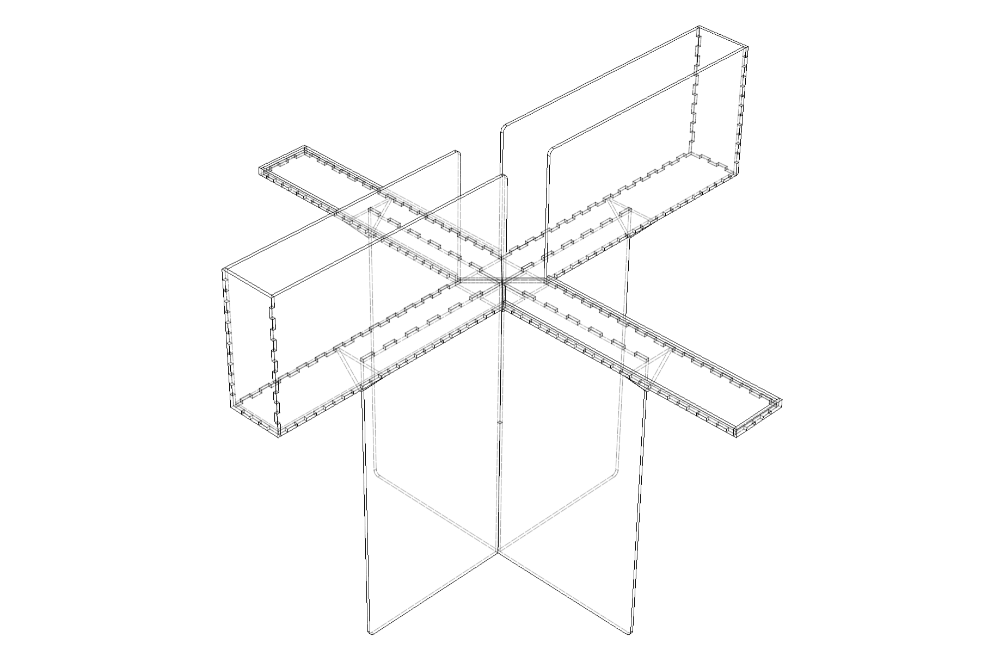

# Elevated Plus Maze

This is a parametric design of an EPM for mice or rats.

Adjust dimensions using the `change parameters` menu in [Fusion 360][Fusion360].

Current dimensions are set for young rats (too big for mice and too small for adult rats).

## Components
- [6mm opaque black acrylic sheets](https://www.polymershapes.com/product/acrylic/)
- [4mm black corrugated plastic sheets](https://www.polymershapes.com/product/polypropylene-twinwall-corrugated-plastic/)

## Build instructions
- Adjust dimensions of the `f3d` file using [Fusion 360][Fusion360], export to `dxf` in `manufacturing mode` and setup a laser cutting machine to cut all parts.
- Remove protective film.
- Finish cutting the corrugated plastic with the help of a utility knife, if needed.
- Assemble all acrylic parts using painter's tape and apply acrylic cement or 2-part epoxy. Remove painter's tape after drying.
- Place the cut corrugated plastic sheets to cover each of the EMP arms.

## Version History
### 0.1.0
* 2024-04-17
  - Initial Release.

## License
© 2024 [Leonardo Molina][Leonardo Molina]

This project is licensed under the [Creative Commons BY-NC-SA 4.0 License](https://creativecommons.org/licenses/by-nc-sa/4.0/).

[Leonardo Molina]: https://github.com/leomol
[LICENSE.md]: LICENSE.md
[Fusion360]: https://www.autodesk.com/ca-en/products/fusion-360